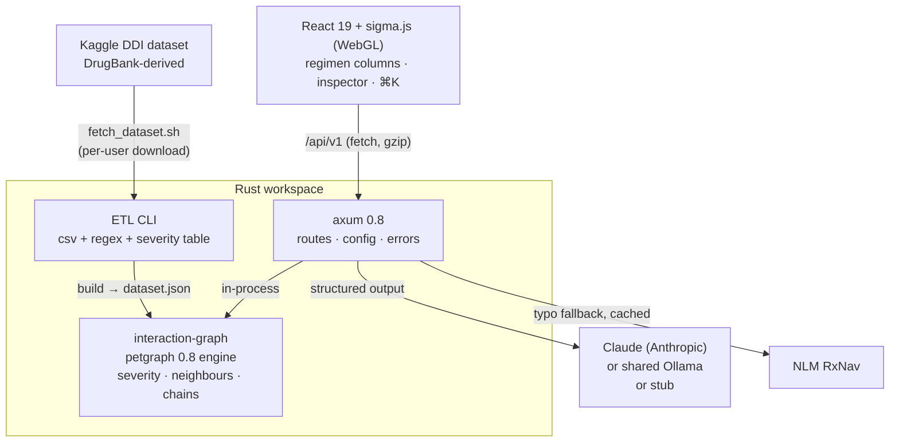

<p align="center">
  <h1>💊 Drug Interaction Visualizer</h1>
  <p><b>Clinician-facing DDI workspace — petgraph engine, WebGL graph, regimen check, grounded AI explanations</b></p>
  <p>
    <a href="https://github.com/akarales/drug-interaction-visualizer/actions/workflows/ci.yml"></a>
    
    
    
    
  </p>
</p>

A drug–drug interaction workspace for clinicians, built on **real data**: the
DrugBank-derived Kaggle dataset (1,701 drugs, 191,135 interactions), fetched
under your own Kaggle account at setup time and never redistributed. A
Rust-native petgraph engine runs in-process with the axum API; the React
client draws every drug on a WebGL (sigma.js) map, builds a medication
regimen in floating columns, flags contraindicated combinations the way a
CPOE system would, and generates a clinician summary plus a patient handout
from the dataset record.

**Jump to:** [Features](#-features) · [Architecture](#-architecture) · [Quickstart](#-quickstart) · [Configuration](#️-configuration) · [API](#-api) · [Docs](#-documentation) · [Roadmap](#️-roadmap)

> [!WARNING]
> Demo application built on public, DrugBank-derived data. Not for clinical
> use. Not medical advice. Severity is **editorial** — a reviewed table by
> interaction type plus the ONC high-priority (contraindicated) pairs
> (Phansalkar et al., JAMIA 2012); the source dataset has no severity field.

## ⚡ Features

- **Regimen workspace** — floating, searchable medication columns
  (Miller-column pattern); every list is annotated with each drug's worst
  interaction against the other picks; pair list or N×N heat-map matrix
- **Contraindication alert** — tiered decision support: only
  contraindicated pairs interrupt, with the seven DDI CDS elements (drugs,
  seriousness, consequence, mechanism, modifying factors, action,
  evidence); keeping both requires a documented override reason
- **Clinician + patient AI output** — one schema-constrained call returns a
  clinician summary (mechanism, monitoring & management) and a
  plain-language patient handout draft (copy or print with a sign-off
  line); dataset severity is authoritative; Claude (Anthropic) or a shared
  local Ollama, chosen in a model chooser; deterministic stub for tests
- **WebGL drug map** — all 1,701 drugs on a deterministic family layout,
  severity rings per node, family-bundled summary edges, no text on the
  canvas (names live in the lists), hover without flicker
- **Hybrid drug search** — offline RxNorm brand/ingredient/salt table
  (1,615 drugs, 4,104 brands: "Coumadin" → Warfarin) plus a live NLM RxNav
  fallback for typos, cached and rate-limited
- **Share, export, navigate** — `?meds=` links with browser Back/Forward,
  CSV export, printable regimen report, ⌘K command palette, `?` shortcuts
- **Editorial severity, documented** — reviewed kind table with per-row
  rationale + ONC high-priority pairs; every edge records which rule graded
  it; the dataset build prints a report of defaulted kinds and upgrades
- **Engineering** — gzip + cache headers, request caps and LLM timeouts,
  43 Rust tests, 17 vitest unit tests, Playwright e2e against the real API
  on a committed fixture; the repo redistributes no data

## 📐 Architecture



The engine and API share one workspace; the frontend talks only to axum.
Full breakdown in [docs/ARCHITECTURE.md](docs/ARCHITECTURE.md).

## 🚀 Quickstart

> [!TIP]
> The real dataset is required to run the app — but `cargo test`,
> `pnpm test` and `pnpm e2e` use committed fixtures and need no Kaggle
> account, network, or GPU.

```bash
# 1. Fetch the dataset (requires the kaggle CLI configured)
./scripts/fetch_dataset.sh

# 2. Normalize, classify and grade it into the engine dataset
cargo run -p interaction-graph -- build \
    data/raw/db_drug_interactions.csv data/ddi_dataset.json

# 3. Optional: offline brand-name search table from RxNorm (~5 min)
cargo run -p drug-interaction-api --bin build_aliases

# 4. Serve the API (port 8001)
cargo run -p drug-interaction-api

# 5. Frontend
cd frontend && pnpm install && pnpm dev   # → http://localhost:5173
```

AI explanations default to the offline stub. Set `APP_LLM_STUB=false` and
`APP_LLM_PROVIDER=anthropic` (with `ANTHROPIC_API_KEY` in a gitignored
`.env`) or `ollama`; the model chooser lists what is available.

## ⚙️ Configuration

| Variable | Default | Notes |
|----------|---------|-------|
| `APP_DATASET_PATH` | `data/ddi_dataset.json` | must exist; fail-fast at startup with setup instructions |
| `APP_LLM_STUB` | `true` | deterministic offline explanations |
| `APP_LLM_PROVIDER` | `ollama` | `ollama` · `anthropic` · `stub` (used when stub=false) |
| `APP_ANTHROPIC_MODEL` | `claude-sonnet-5-5` | `ANTHROPIC_API_KEY` required for Anthropic |
| `APP_OLLAMA_URL` / `APP_OLLAMA_MODEL` | `http://localhost:11434` / `qwen3:14b` | shared instance: models are used as-is, never pulled or changed |
| `APP_OLLAMA_KEEP_ALIVE` | `2m` | how long our model stays loaded |
| `APP_ALIASES_PATH` | `data/aliases.json` | offline RxNorm names (optional) |
| `APP_RXNAV_ENABLED` | `true` | live RxNav fallback for typos and brands |
| `APP_PORT` | `8001` | API port |

## 📡 API

| Endpoint | Purpose |
|----------|---------|
| `GET /health` | liveness |
| `GET /api/v1/drugs` | every drug + aliases, severity mix, dataset stats |
| `GET /api/v1/drugs/{id}/neighbors` | direct interactions: kind, severity + basis, source sentence |
| `GET /api/v1/resolve?q=` | hybrid name resolution (offline aliases → RxNav) |
| `GET /api/v1/llm/models` | model chooser: Claude models, shared-Ollama models (loaded flag), stub |
| `POST /api/v1/explain` | clinician summary + patient handout (`audience`, `provider`, `model`) |
| `GET /api/v1/interactions/chain?from=&to=&max_hops=` | multi-hop chain |
| `GET /api/v1/graph?top=N` · `/graph/ego` | hub / ego subgraphs (capped) |

Request/response examples with curl: [docs/API.md](docs/API.md).

## 📚 Documentation

| Page | What's inside |
|------|---------------|
| [docs/ARCHITECTURE.md](docs/ARCHITECTURE.md) | Crate breakdown, ETL classification pipeline, BFS chain algorithm, subgraph export logic |
| [docs/API.md](docs/API.md) | Full endpoint reference — curl + JSON payloads + error taxonomy |
| [docs/DEVELOPMENT.md](docs/DEVELOPMENT.md) | Human dev guide — setup, testing, verification, gotchas |

## 🗺️ Roadmap

<details>
<summary>Phased plan</summary>

- [x] v1 — engine, ETL, API, D3 visualization, CI
- [x] v2 — WebGL map, regimen columns + matrix, editorial severity with ONC
      tier, contraindication alert with overrides, hybrid RxNorm search,
      clinician + patient AI output (Claude / shared Ollama), share links,
      CSV + print, ⌘K palette, unit + e2e tests
- [ ] Interaction direction (precipitant → object) from a citable source —
      the Kaggle text reverses roles for inhibitors, so it is not derived
      from the sentences
- [ ] Streaming AI explanations
- [ ] Demo GIF and screenshots

</details>

## 🤝 Contributing

PRs welcome — see [CONTRIBUTING.md](CONTRIBUTING.md). All checks green
before merge (`cargo clippy --workspace --all-targets -- -D warnings`,
`cargo test --workspace -q`, `pnpm build`, `pnpm lint`, `pnpm test`,
`pnpm e2e`).

## 📄 License

MIT — see [LICENSE](LICENSE).
