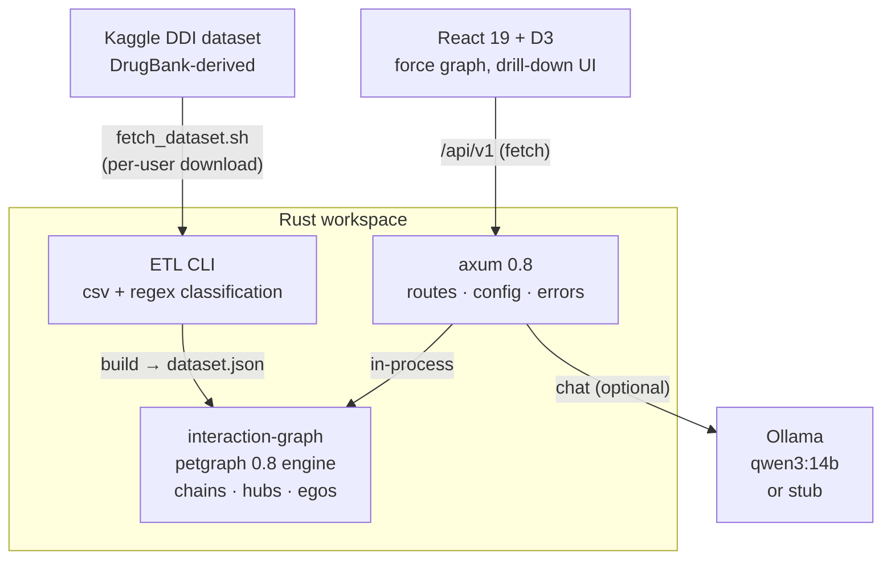

<p align="center">
  <h1>💊 Drug Interaction Visualizer</h1>
  <p><b>Real-scale DDI knowledge graph — petgraph engine, D3 visualization, LLM explanations</b></p>
  <p>
    <a href="https://github.com/akarales/drug-interaction-visualizer/actions/workflows/ci.yml"></a>
    
    
    
    
  </p>
</p>

A drug–drug interaction explorer built on **real data**: the DrugBank-derived
Kaggle dataset (1,701 drugs, 191,135 interactions), fetched under your own
Kaggle account at setup time and never redistributed. Rust-native — the
petgraph engine lives in-process with the axum API, and the 191K-edge graph
never crosses into a client. Multi-hop interaction chains, hub subgraphs and
ego views are all computed server-side; the React + D3 client renders what
Rust hands it.

**Jump to:** [Features](#-features) · [Architecture](#-architecture) · [Quickstart](#-quickstart) · [Configuration](#️-configuration) · [API](#-api) · [Docs](#-documentation) · [Roadmap](#️-roadmap)

> [!WARNING]
> Demo application built on public, DrugBank-derived data. Not for clinical
> use. Not medical advice. Severity labels are a documented heuristic — the
> source dataset contains no severity field.

## ⚡ Features

- **Real-scale graph engine** — 191,135 typed interaction edges in petgraph,
  loaded once; subgraph exports (top-N hubs, ego networks) computed in Rust
- **Multi-hop interaction chains** — BFS shortest-path between two drugs
  through the interaction graph ("does A reach B via an intermediary?")
- **Deterministic data pipeline** — a `csv`+`regex` ETL CLI that classifies
  99.6% of interactions from 15 source description templates, with
  documented severity heuristics
- **LLM explanations** — schema-constrained Ollama output (severity,
  mechanism, recommendation) with a deterministic stub mode so the demo runs
  GPU-less
- **D3 force visualization** — top-hub and ego views with severity-weighted
  edges, click-through drug details, chain finder
- **Data licensing discipline** — the Kaggle CSV and built dataset are
  gitignored; the repo redistributes nothing

## 📐 Architecture



The engine and API share one workspace; the frontend talks only to axum.
Full breakdown in [docs/ARCHITECTURE.md](docs/ARCHITECTURE.md).

## 🚀 Quickstart

> [!TIP]
> The real dataset is required (a user decision for this project) — but
> `cargo test` runs against a committed fixture and needs no Kaggle
> account, network, or GPU.

```bash
# 1. Fetch the dataset (requires the kaggle CLI configured)
./scripts/fetch_dataset.sh

# 2. Normalize + classify it into the engine dataset
cargo run -p interaction-graph -- build \
    data/raw/db_drug_interactions.csv data/ddi_dataset.json

# 3. Serve the API (port 8001)
cargo run -p drug-interaction-api

# 4. Frontend
cd frontend && pnpm install && pnpm dev   # → http://localhost:5173
```

LLM explanations default to **stub mode** — set `APP_LLM_STUB=false` with a
running Ollama instance for real synthesis.

## ⚙️ Configuration

| Variable | Default | Notes |
|----------|---------|-------|
| `APP_DATASET_PATH` | `data/ddi_dataset.json` | must exist; fail-fast at startup with setup instructions |
| `APP_LLM_STUB` | `true` | deterministic offline explanations |
| `APP_OLLAMA_URL` | `http://localhost:11434` | used when stub=false |
| `APP_OLLAMA_MODEL` | `qwen3:14b` | local GPU model |
| `APP_PORT` | `8001` | 8000 is taken by ZAP_AGI on this machine |

## 📡 API

| Endpoint | Purpose |
|----------|---------|
| `GET /health` | liveness |
| `GET /api/v1/graph?top=N` | top-N hub subgraph (0 = full 191K-edge graph) |
| `GET /api/v1/graph/ego?drug=&hops=1` | ego network, induced edges |
| `GET /api/v1/drugs` | all drugs with interaction counts |
| `GET /api/v1/drugs/{id}/neighbors` | direct interactions incl. mechanisms |
| `GET /api/v1/interactions/chain?from=&to=&max_hops=` | multi-hop chain |
| `POST /api/v1/explain` | LLM plain-language explanation of a pair |

Request/response examples with curl: [docs/API.md](docs/API.md).

## 📚 Documentation

| Page | What's inside |
|------|---------------|
| [docs/ARCHITECTURE.md](docs/ARCHITECTURE.md) | Crate breakdown, ETL classification pipeline, BFS chain algorithm, subgraph export logic |
| [docs/API.md](docs/API.md) | Full endpoint reference — curl + JSON payloads + error taxonomy |
| [docs/DEVELOPMENT.md](docs/DEVELOPMENT.md) | Human dev guide — setup, testing, verification, gotchas |

## 🗺️ Roadmap

<details>
<summary>Phased plan</summary>

- [x] Phase 0 — scaffold: engine, ETL, API, visualization shell, CI
- [ ] Phase 1 — severity-filtered views, search-as-you-type
- [ ] Phase 2 — streaming LLM explanations; multi-model routing demo
- [ ] Phase 3 — patient-medication "risk walk" (upload a med list, walk the graph)

</details>

## 🤝 Contributing

PRs welcome — see [CONTRIBUTING.md](CONTRIBUTING.md). All checks green
before merge (`cargo clippy --workspace --all-targets -- -D warnings`,
`cargo test --workspace -q`, `pnpm build`).

## 📄 License

MIT — see [LICENSE](LICENSE).
